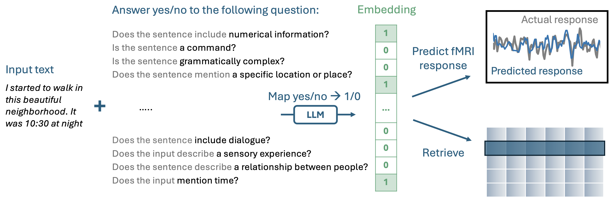

<h1 align="center"> ❓ Question-Answering Embeddings ❓ </h1>
<p align="center"> Crafting Interpretable Embeddings by Asking LLMs Questions, code for the <a href="">QA-Emb paper</a> (coming soon). 
</p>

<p align="center">
  
  
</p>  

<p align="center"> QA-Embs builds an interpretable embeddings by asking a series of yes-no questions to a pre-trained autoregressive LLM.<br/>
 </img>	 <br/>
</p>

# Quickstart
If you just want to use QA-Emb in your own application, the easiest way is through the [imodelsX package](https://github.com/csinva/imodelsX). To install, just run `pip install imodelsx`.

Then, you can generate your own interpretable embeddings by coming up with questions for your domain:
```python
from imodelsx import QAEmb
import pandas as pd

questions = [
    'Is the input related to food preparation?',
    'Does the input mention laughter?',
    'Is there an expression of surprise?',
    'Is there a depiction of a routine or habit?',
    'Does the sentence contain stuttering?',
    'Does the input contain a first-person pronoun?',
]
examples = [
    'i sliced some cucumbers and then moved on to what was next',
    'the kids were giggling about the silly things they did',
    'and i was like whoa that was unexpected',
    'walked down the path like i always did',
    'um no um then it was all clear',
    'i was walking to school and then i saw a cat',
]

checkpoint = 'meta-llama/Meta-Llama-3-8B-Instruct'

embedder = QAEmb(
    questions=questions, checkpoint=checkpoint, use_cache=False)
embeddings = embedder(examples)

df = pd.DataFrame(embeddings.astype(int), columns=[
    q.split()[-1] for q in questions])
df.index = examples
df.columns.name = 'Question (abbreviated)'
display(df.style.background_gradient(axis=None))
--------DISPLAYS ANSWER FOR EACH QUESTION IN EMBEDDING--------
```


# Dataset set up

Directions for installing the datasets required for reproducing the fMRI experiments in the paper.

- download data with `python experiments/00_load_dataset.py`
    - create a `data` dir under wherever you run it and will use [datalad](https://github.com/datalad/datalad) to download the preprocessed data as well as feature spaces needed for fitting [semantic encoding models](https://www.nature.com/articles/nature17637)
- set `neuro1.config.root_dir` to where you want to store the data
- to make flatmaps, need to set [pycortex filestore] to `{root_dir}/ds003020/derivative/pycortex-db/`
- to run eng1000, need to grab `em_data` directory from [here](https://github.com/HuthLab/deep-fMRI-dataset) and move its contents to `{root_dir}/em_data`
- loading responses
  - `neuro1.data.response_utils` function `load_response`
  - loads responses from at `{root_dir}/ds003020/derivative/preprocessed_data/{subject}`, hwere they are stored in an h5 file for each story, e.g. `wheretheressmoke.h5`
- loading stimulus
  - `neuro1.features.stim_utils` function `load_story_wordseqs`
  - loads textgrids from `{root_dir}/ds003020/derivative/TextGrids", where each story has a TextGrid file, e.g. `wheretheressmoke.TextGrid`
  - uses `{root_dir}/ds003020/derivative/respdict.json` to get the length of each story

# Code install

Directions for installing the code here as a package for full development.

- from the repo directory, start with `pip install -e .` to locally install the `neuro1` package
- `python 01_fit_encoding.py --subject UTS03 --feature eng1000`
    - The other optional parameters that encoding.py takes such as sessions, ndelays, single_alpha allow the user to change the amount of data and regularization aspects of the linear regression used. 
    - This function will then save model performance metrics and model weights as numpy arrays. 